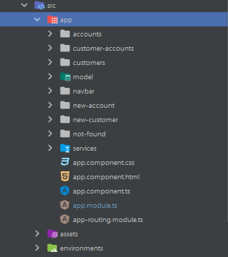
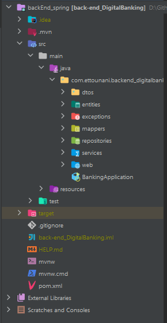

# Digital Banking

## Description

This is a digital banking application that allows users to create an account, login, and perform various banking transactions.

## Table of Contents

- [Frontend](#frontend)
  - [Installation](#installation)
  - [Components](#components)
  - [Services](#services)
  - [Models](#models)
  - [Demo](#demo)
- [Backend](#backend)
  - [Controllers](#rest-apis)
  - [Services](#services-1)
  - [Repositories](#repositories)
  - [Entities](#entities)
  - [DTOs](#dtos)
  - [Exceptions](#exceptions)
  - [Enums](#enums)
  - [Security](#security)
  - [Demo](#demo-1)
- [What I Learned](#what-i-learned)
  - [Technologies Used](#technologies-used)
  - [Future Development](#future-development)

## Frontend

### Installation

1. Clone the repo
   ```sh
   git clone
   ```
2. Install NPM packages
   ```sh
   cd frontend_angular
   npm install
   ```
3. Start the application
   ```sh
   ng serve
   ```
4. Navigate to http://localhost:4200/ in your browser

### Components

- **app-routing.module** - Routing module

```ts
const routes: Routes = [
  { path: "", redirectTo: "/accounts", pathMatch: "full" },
  { path: "accounts", component: AccountsComponent },
  { path: "customers", component: CustomersComponent },
  { path: "customer-accounts/:id", component: CustomerAccountsComponent },
  { path: "new-customer", component: NewCustomerComponent },
  { path: "new-account", component: NewAccountComponent },
  { path: "**", component: NotFoundComponent },
];

@NgModule({
  imports: [RouterModule.forRoot(routes)],
  exports: [RouterModule],
})
export class AppRoutingModule {}
```

- **Accounts** - Displays all accounts associated with the customer

```ts
@Component({
  selector: "app-accounts",
  templateUrl: "./accounts.component.html",
  styleUrls: ["./accounts.component.css"],
})
export class AccountsComponent implements OnInit {
  accountFormGroup!: FormGroup;
  currentPage: number = 0;
  pageSize: number = 5;
  accountObservable!: Observable<AccountDetails>;
  operationFromGroup!: FormGroup;
  errorMessage!: string;

  constructor(
    private fb: FormBuilder,
    private accountService: AccountsService
  ) {}

  ngOnInit(): void {
    this.accountFormGroup = this.fb.group({
      accountId: this.fb.control(""),
    });
    this.operationFromGroup = this.fb.group({
      operationType: this.fb.control(null),
      amount: this.fb.control(0),
      description: this.fb.control(null),
      accountDestination: this.fb.control(null),
    });
  }

  handleSearchAccount() {
    let accountId: string = this.accountFormGroup.value.accountId;
    this.accountObservable = this.accountService
      .getAccount(accountId, this.currentPage, this.pageSize)
      .pipe(
        catchError((err) => {
          this.errorMessage = err.message;
          return throwError(err);
        })
      );
  }

  gotoPage(page: number) {
    this.currentPage = page;
    this.handleSearchAccount();
  }

  handleAccountOperation() {
    let accountId: string = this.accountFormGroup.value.accountId;
    let operationType = this.operationFromGroup.value.operationType;
    let amount: number = this.operationFromGroup.value.amount;
    let description: string = this.operationFromGroup.value.description;
    let accountDestination: string =
      this.operationFromGroup.value.accountDestination;
    if (operationType == "DEBIT") {
      this.accountService.debit(accountId, amount, description).subscribe({
        next: (data) => {
          alert("Success Credit");
          this.operationFromGroup.reset();
          this.handleSearchAccount();
        },
        error: (err) => {
          console.log(err);
        },
      });
    } else if (operationType == "CREDIT") {
      this.accountService.credit(accountId, amount, description).subscribe({
        next: (data) => {
          alert("Success Debit");
          this.operationFromGroup.reset();
          this.handleSearchAccount();
        },
        error: (err) => {
          console.log(err);
        },
      });
    } else if (operationType == "TRANSFER") {
      this.accountService
        .transfer(accountId, accountDestination, amount, description)
        .subscribe({
          next: (data) => {
            alert("Success Transfer");
            this.operationFromGroup.reset();
            this.handleSearchAccount();
          },
          error: (err) => {
            console.log(err);
          },
        });
    }
  }
}
```

- **Customer** - Displays customer information

```ts
@Component({
  selector: "app-customers",
  templateUrl: "./customers.component.html",
  styleUrls: ["./customers.component.css"],
})
export class CustomersComponent implements OnInit {
  customers!: Observable<Array<Customer>>;
  errorMessage!: string;
  searchFormGroup: FormGroup | undefined;
  constructor(
    private customerService: CustomerService,
    private fb: FormBuilder,
    private router: Router
  ) {}

  ngOnInit(): void {
    this.searchFormGroup = this.fb.group({
      keyword: this.fb.control(""),
    });
    this.handleSearchCustomers();
  }
  handleSearchCustomers() {
    let kw = this.searchFormGroup?.value.keyword;
    this.customers = this.customerService.searchCustomers(kw).pipe(
      catchError((err) => {
        this.errorMessage = err.message;
        return throwError(err);
      })
    );
  }

  handleDeleteCustomer(c: Customer) {
    let conf = confirm("Are you sure?");
    if (!conf) return;
    this.customerService.deleteCustomer(c.id).subscribe({
      next: (resp) => {
        this.customers = this.customers.pipe(
          map((data) => {
            let index = data.indexOf(c);
            data.slice(index, 1);
            return data;
          })
        );
      },
      error: (err) => {
        console.log(err);
      },
    });
  }

  handleCustomerAccounts(customer: Customer) {
    this.router.navigateByUrl("/customer-accounts/" + customer.id, {
      state: customer,
    });
  }
}
```

- **Customer-accounts** - Displays all accounts associated with the customer

```ts
@Component({
  selector: "app-customer-accounts",
  templateUrl: "./customer-accounts.component.html",
  styleUrls: ["./customer-accounts.component.css"],
})
export class CustomerAccountsComponent implements OnInit {
  customerId!: string;
  customer!: Customer;
  constructor(private route: ActivatedRoute, private router: Router) {
    this.customer = this.router.getCurrentNavigation()?.extras
      .state as Customer;
  }

  ngOnInit(): void {
    this.customerId = this.route.snapshot.params["id"];
  }
}
```

- **new-customer** - Allows the user to create a new customer

```ts
@Component({
  selector: "app-new-customer",
  templateUrl: "./new-customer.component.html",
  styleUrls: ["./new-customer.component.css"],
})
export class NewCustomerComponent implements OnInit {
  newCustomerFormGroup!: FormGroup;
  constructor(
    private fb: FormBuilder,
    private customerService: CustomerService,
    private router: Router
  ) {}

  ngOnInit(): void {
    this.newCustomerFormGroup = this.fb.group({
      name: this.fb.control(null, [
        Validators.required,
        Validators.minLength(4),
      ]),
      email: this.fb.control(null, [Validators.required, Validators.email]),
    });
  }

  handleSaveCustomer() {
    let customer: Customer = this.newCustomerFormGroup.value;
    this.customerService.saveCustomer(customer).subscribe({
      next: (data) => {
        alert("Customer has been successfully saved!");
        //this.newCustomerFormGroup.reset();
        this.router.navigateByUrl("/customers");
      },
      error: (err) => {
        console.log(err);
      },
    });
  }
}
```

- **new-account** - Allows the user to create a new account

```ts
@Component({
  selector: "app-new-account",
  templateUrl: "./new-account.component.html",
  styleUrls: ["./new-account.component.css"],
})
export class NewAccountComponent implements OnInit {
  newAccountFormGroup!: FormGroup;
  customers!: Observable<Array<Customer>>;
  constructor(
    private fb: FormBuilder,
    private accountService: AccountsService,
    private customerService: CustomerService,
    private router: Router
  ) {}

  ngOnInit(): void {
    this.newAccountFormGroup = this.fb.group({
      accountNumber: this.fb.control(null, [
        Validators.required,
        Validators.minLength(4),
      ]),
      accountType: this.fb.control(null, [Validators.required]),
      customerId: this.fb.control(null, [Validators.required]),
    });
    this.customers = this.customerService.getAllCustomers();
  }

  handleSaveAccount() {
    let account: Account = this.newAccountFormGroup.value;
    this.accountService.saveAccount(account).subscribe({
      next: (data) => {
        alert("Account has been successfully saved!");
        this.newAccountFormGroup.reset();
        this.router.navigateByUrl("/accounts");
      },
      error: (err) => {
        console.log(err);
      },
    });
  }
}
```

```html
<div class="container">
  <div class="row">
    <div class="col">
      <h1>New Account</h1>
      <form [formGroup]="newAccountFormGroup" (ngSubmit)="handleSaveAccount()">
        <div class="form-group">
          <label for="accountNumber">Account Number</label>
          <input
            type="text"
            class="form-control"
            id="accountNumber"
            formControlName="accountNumber"
          />
        </div>
        <div class="form-group">
          <label for="accountType">Account Type</label>
          <select
            class="form-control"
            id="accountType"
            formControlName="accountType"
          >
            <option value="SAVING">Saving</option>
            <option value="CURRENT">Current</option>
          </select>
        </div>
        <div class="form-group">
          <label for="customerId">Customer</label>
          <select
            class="form-control"
            id="customerId"
            formControlName="customerId"
          >
            <option *ngFor="let c of customers | async" [value]="c.id">
              {{c.name}}
            </option>
          </select>
        </div>
        <button type="submit" class="btn btn-primary">Submit</button>
      </form>
    </div>
  </div>
</div>
```

- **navbar** - Navigation bar

```ts
@Component({
  selector: "app-navbar",
  templateUrl: "./navbar.component.html",
  styleUrls: ["./navbar.component.css"],
})
export class NavbarComponent implements OnInit {
  constructor() {}

  ngOnInit(): void {}
}
```

```html
<nav class="navbar navbar-expand-lg navbar-dark bg-dark">
  <div class="container-fluid">
    <a class="navbar-brand" href="#">Navbar</a>
    <button
      class="navbar-toggler"
      type="button"
      data-bs-toggle="collapse"
      data-bs-target="#navbarSupportedContent"
      aria-controls="navbarSupportedContent"
      aria-expanded="false"
      aria-label="Toggle navigation"
    >
      <span class="navbar-toggler-icon"></span>
    </button>
    <div class="collapse navbar-collapse" id="navbarSupportedContent">
      <ul class="navbar-nav me-auto mb-2 mb-lg-0">
        <li class="nav-item">
          <a class="nav-link active" aria-current="page" href="#">Home</a>
        </li>
        <li class="nav-item">
          <a class="nav-link" routerLink="/accounts">Accounts</a>
        </li>
        <li class="nav-item dropdown">
          <a
            class="nav-link dropdown-toggle"
            href="#"
            id="navbarDropdown"
            role="button"
            data-bs-toggle="dropdown"
            aria-expanded="false"
          >
            Customers
          </a>
          <ul class="dropdown-menu" aria-labelledby="navbarDropdown">
            <li>
              <a class="dropdown-item" routerLink="/customers"
                >Search customers</a
              >
            </li>
            <li>
              <a class="dropdown-item" routerLink="/new-customer"
                >New customer</a
              >
            </li>
          </ul>
        </li>
        <li class="nav-item">
          <a
            class="nav-link disabled"
            href="#"
            tabindex="-1"
            aria-disabled="true"
            >Disabled</a
          >
        </li>
      </ul>
      <form class="d-flex">
        <input
          class="form-control me-2"
          type="search"
          placeholder="Search"
          aria-label="Search"
        />
        <button class="btn btn-outline-success" type="submit">Search</button>
      </form>
    </div>
  </div>
</nav>
```

- **not-found** - Displays a 404 error page

```ts
@Component({
  selector: "app-not-found",
  templateUrl: "./not-found.component.html",
  styleUrls: ["./not-found.component.css"],
})
export class NotFoundComponent implements OnInit {
  constructor() {}

  ngOnInit(): void {}
}
```

```html
<div class="container">
  <div class="row">
    <div class="col-md-12">
      <h1>404</h1>
      <h2>Page not found</h2>
    </div>
  </div>
</div>
```

### Services

- **AccountsService** - Provides methods to interact with the accounts API

```ts
@Injectable({
  providedIn: "root",
})
export class AccountsService {
  constructor(private http: HttpClient) {}

  public getAccount(
    accountId: string,
    page: number,
    size: number
  ): Observable<AccountDetails> {
    return this.http.get<AccountDetails>(
      environment.backendHost +
        "/accounts/" +
        accountId +
        "/pageOperations?page=" +
        page +
        "&size=" +
        size
    );
  }
  public debit(accountId: string, amount: number, description: string) {
    let data = {
      accountId: accountId,
      amount: amount,
      description: description,
    };
    return this.http.post(environment.backendHost + "/accounts/debit", data);
  }
  public credit(accountId: string, amount: number, description: string) {
    let data = {
      accountId: accountId,
      amount: amount,
      description: description,
    };
    return this.http.post(environment.backendHost + "/accounts/credit", data);
  }
  public transfer(
    accountSource: string,
    accountDestination: string,
    amount: number,
    description: string
  ) {
    let data = { accountSource, accountDestination, amount, description };
    return this.http.post(environment.backendHost + "/accounts/transfer", data);
  }
  public saveAccount(account: Account): Observable<AccountDetails> {
    return this.http.post<AccountDetails>(
      environment.backendHost + "/accounts",
      account
    );
  }
}
```

- **CustomerService** - Provides methods to interact with the customers API

```ts
@Injectable({
  providedIn: "root",
})
export class CustomerService {
  constructor(private http: HttpClient) {}

  public getCustomers(): Observable<Array<Customer>> {
    return this.http.get<Array<Customer>>(
      environment.backendHost + "/customers"
    );
  }
  public searchCustomers(keyword: string): Observable<Array<Customer>> {
    return this.http.get<Array<Customer>>(
      environment.backendHost + "/customers/search?keyword=" + keyword
    );
  }
  public saveCustomer(customer: Customer): Observable<Customer> {
    return this.http.post<Customer>(
      environment.backendHost + "/customers",
      customer
    );
  }
  public deleteCustomer(id: number) {
    return this.http.delete(environment.backendHost + "/customers/" + id);
  }
}
```

### Models

- **Account** - Represents an account

```ts
export class Account {
  accountNumber!: string;
  accountType!: string;
  customer!: Customer;
}
```

- **AccountDetails** - Represents an account with its operations

```ts
export interface AccountDetails {
  accountId: string;
  balance: number;
  currentPage: number;
  totalPages: number;
  pageSize: number;
  accountOperationDTOS: AccountOperation[];
}
```

- **AccountOperation** - Represents an account operation

```ts
export interface AccountOperation {
  id: number;
  operationDate: Date;
  amount: number;
  type: string;
  description: string;
}
```

- **Customer** - Represents a customer

```ts
export interface Customer {
  id: number;
  name: string;
  email: string;
}
```

### Demo



https://github.com/ET-TOUNANI/Spring-Angular/assets/74843162/06cfcf1f-18a6-4602-a351-e6b675f84f94


## Backend

The backend is a Spring Boot application that exposes REST APIs to manage customers and accounts. It uses Spring Data JPA to interact with a H2 database.

### REST APIs

```java
@RestController
@CrossOrigin("*")
public class BankAccountRestAPI {
    private BankAccountService bankAccountService;

    public BankAccountRestAPI(BankAccountService bankAccountService) {
        this.bankAccountService = bankAccountService;
    }

    @GetMapping("/accounts/{accountId}")
    public BankAccountDTO getBankAccount(@PathVariable String accountId) throws BankAccountNotFoundException {
        return bankAccountService.getBankAccount(accountId);
    }

    @GetMapping("/accounts")
    public List<BankAccountDTO> listAccounts() {
        return bankAccountService.bankAccountList();
    }

    @GetMapping("/accounts/{accountId}/operations")
    public List<AccountOperationDTO> getHistory(@PathVariable String accountId) {
        return bankAccountService.accountHistory(accountId);
    }

    @GetMapping("/accounts/{accountId}/pageOperations")
    public AccountHistoryDTO getAccountHistory(
            @PathVariable String accountId,
            @RequestParam(name = "page", defaultValue = "0") int page,
            @RequestParam(name = "size", defaultValue = "5") int size) throws BankAccountNotFoundException {
        return bankAccountService.getAccountHistory(accountId, page, size);
    }

    @PostMapping("/accounts/debit")
    public DebitDTO debit(@RequestBody DebitDTO debitDTO) throws BankAccountNotFoundException, BalanceNotSufficientException {
        this.bankAccountService.debit(debitDTO.getAccountId(), debitDTO.getAmount(), debitDTO.getDescription());
        return debitDTO;
    }

    @PostMapping("/accounts/credit")
    public CreditDTO credit(@RequestBody CreditDTO creditDTO) throws BankAccountNotFoundException {
        this.bankAccountService.credit(creditDTO.getAccountId(), creditDTO.getAmount(), creditDTO.getDescription());
        return creditDTO;
    }

    @PostMapping("/accounts/transfer")
    public void transfer(@RequestBody TransferRequestDTO transferRequestDTO) throws BankAccountNotFoundException, BalanceNotSufficientException {
        this.bankAccountService.transfer(
                transferRequestDTO.getAccountSource(),
                transferRequestDTO.getAccountDestination(),
                transferRequestDTO.getAmount());
    }
}
```

```java
@RestController
@AllArgsConstructor
@Slf4j
@CrossOrigin("*")
public class CustomerRestController {
    private BankAccountService bankAccountService;

    @GetMapping("/customers")
    public List<CustomerDTO> customers() {
        return bankAccountService.listCustomers();
    }

    @GetMapping("/customers/search")
    public List<CustomerDTO> searchCustomers(@RequestParam(name = "keyword", defaultValue = "") String keyword) {
        return bankAccountService.searchCustomers("%" + keyword + "%");
    }

    @GetMapping("/customers/{id}")
    public CustomerDTO getCustomer(@PathVariable(name = "id") Long customerId) throws CustomerNotFoundException {
        return bankAccountService.getCustomer(customerId);
    }

    @PostMapping("/customers")
    public CustomerDTO saveCustomer(@RequestBody CustomerDTO customerDTO) {
        return bankAccountService.saveCustomer(customerDTO);
    }

    @PutMapping("/customers/{customerId}")
    public CustomerDTO updateCustomer(@PathVariable Long customerId, @RequestBody CustomerDTO customerDTO) {
        customerDTO.setId(customerId);
        return bankAccountService.updateCustomer(customerDTO);
    }

    @DeleteMapping("/customers/{id}")
    public void deleteCustomer(@PathVariable Long id) {
        bankAccountService.deleteCustomer(id);
    }
}
```

### Services-1

```java
public interface BankAccountService {
    CustomerDTO saveCustomer(CustomerDTO customerDTO);

    CurrentBankAccountDTO saveCurrentBankAccount(double initialBalance, double overDraft, Long customerId) throws CustomerNotFoundException;

    SavingBankAccountDTO saveSavingBankAccount(double initialBalance, double interestRate, Long customerId) throws CustomerNotFoundException;

    List<CustomerDTO> listCustomers();

    BankAccountDTO getBankAccount(String accountId) throws BankAccountNotFoundException;

    void debit(String accountId, double amount, String description) throws BankAccountNotFoundException, BalanceNotSufficientException;

    void credit(String accountId, double amount, String description) throws BankAccountNotFoundException;

    void transfer(String accountIdSource, String accountIdDestination, double amount) throws BankAccountNotFoundException, BalanceNotSufficientException;

    List<BankAccountDTO> bankAccountList();

    CustomerDTO getCustomer(Long customerId) throws CustomerNotFoundException;

    CustomerDTO updateCustomer(CustomerDTO customerDTO);

    void deleteCustomer(Long customerId);

    List<AccountOperationDTO> accountHistory(String accountId);

    AccountHistoryDTO getAccountHistory(String accountId, int page, int size) throws BankAccountNotFoundException;

    List<CustomerDTO> searchCustomers(String keyword);
}
```

```java
@Service
@Transactional
@AllArgsConstructor
@Slf4j
public class BankAccountServiceImpl implements BankAccountService {
    private CustomerRepository customerRepository;
    private BankAccountRepository bankAccountRepository;
    private AccountOperationRepository accountOperationRepository;
    private BankAccountMapperImpl dtoMapper;

    @Override
    public CustomerDTO saveCustomer(CustomerDTO customerDTO) {
        log.info("Saving new Customer");
        Customer customer = dtoMapper.fromCustomerDTO(customerDTO);
        Customer savedCustomer = customerRepository.save(customer);
        return dtoMapper.fromCustomer(savedCustomer);
    }

    @Override
    public CurrentBankAccountDTO saveCurrentBankAccount(double initialBalance, double overDraft, Long customerId) throws CustomerNotFoundException {
        Customer customer = customerRepository.findById(customerId).orElse(null);
        if (customer == null)
            throw new CustomerNotFoundException("Customer not found");
        CurrentAccount currentAccount = new CurrentAccount();
        currentAccount.setId(UUID.randomUUID().toString());
        currentAccount.setCreatedAt(new Date());
        currentAccount.setBalance(initialBalance);
        currentAccount.setOverDraft(overDraft);
        currentAccount.setCustomer(customer);
        CurrentAccount savedBankAccount = bankAccountRepository.save(currentAccount);
        return dtoMapper.fromCurrentBankAccount(savedBankAccount);
    }

    @Override
    public SavingBankAccountDTO saveSavingBankAccount(double initialBalance, double interestRate, Long customerId) throws CustomerNotFoundException {
        Customer customer = customerRepository.findById(customerId).orElse(null);
        if (customer == null)
            throw new CustomerNotFoundException("Customer not found");
        SavingAccount savingAccount = new SavingAccount();
        savingAccount.setId(UUID.randomUUID().toString());
        savingAccount.setCreatedAt(new Date());
        savingAccount.setBalance(initialBalance);
        savingAccount.setInterestRate(interestRate);
        savingAccount.setCustomer(customer);
        SavingAccount savedBankAccount = bankAccountRepository.save(savingAccount);
        return dtoMapper.fromSavingBankAccount(savedBankAccount);
    }

    @Override
    public List<CustomerDTO> listCustomers() {
        List<Customer> customers = customerRepository.findAll();
        List<CustomerDTO> customerDTOS = customers.stream()
                .map(customer -> dtoMapper.fromCustomer(customer))
                .collect(Collectors.toList());
        /*
        List<CustomerDTO> customerDTOS=new ArrayList<>();
        for (Customer customer:customers){
            CustomerDTO customerDTO=dtoMapper.fromCustomer(customer);
            customerDTOS.add(customerDTO);
        }
        *
         */
        return customerDTOS;
    }

    @Override
    public BankAccountDTO getBankAccount(String accountId) throws BankAccountNotFoundException {
        BankAccount bankAccount = bankAccountRepository.findById(accountId)
                .orElseThrow(() -> new BankAccountNotFoundException("BankAccount not found"));
        if (bankAccount instanceof SavingAccount) {
            SavingAccount savingAccount = (SavingAccount) bankAccount;
            return dtoMapper.fromSavingBankAccount(savingAccount);
        } else {
            CurrentAccount currentAccount = (CurrentAccount) bankAccount;
            return dtoMapper.fromCurrentBankAccount(currentAccount);
        }
    }

    @Override
    public void debit(String accountId, double amount, String description) throws BankAccountNotFoundException, BalanceNotSufficientException {
        BankAccount bankAccount = bankAccountRepository.findById(accountId)
                .orElseThrow(() -> new BankAccountNotFoundException("BankAccount not found"));
        if (bankAccount.getBalance() < amount)
            throw new BalanceNotSufficientException("Balance not sufficient");
        AccountOpperation accountOperation = new AccountOpperation();
        accountOperation.setType(OperationType.DEBIT);
        accountOperation.setAmount(amount);
        accountOperation.setOperationDate(new Date());
        accountOperation.setBankAccount(bankAccount);
        accountOperationRepository.save(accountOperation);
        bankAccount.setBalance(bankAccount.getBalance() - amount);
        bankAccountRepository.save(bankAccount);
    }

    @Override
    public void credit(String accountId, double amount, String description) throws BankAccountNotFoundException {
        BankAccount bankAccount = bankAccountRepository.findById(accountId)
                .orElseThrow(() -> new BankAccountNotFoundException("BankAccount not found"));
        AccountOpperation accountOperation = new AccountOpperation();
        accountOperation.setType(OperationType.CREDIT);
        accountOperation.setAmount(amount);
        accountOperation.setOperationDate(new Date());
        accountOperation.setBankAccount(bankAccount);
        accountOperationRepository.save(accountOperation);
        bankAccount.setBalance(bankAccount.getBalance() + amount);
        bankAccountRepository.save(bankAccount);
    }

    @Override
    public void transfer(String accountIdSource, String accountIdDestination, double amount) throws BankAccountNotFoundException, BalanceNotSufficientException {
        debit(accountIdSource, amount, "Transfer to " + accountIdDestination);
        credit(accountIdDestination, amount, "Transfer from " + accountIdSource);
    }

    @Override
    public List<BankAccountDTO> bankAccountList() {
        List<BankAccount> bankAccounts = bankAccountRepository.findAll();
        List<BankAccountDTO> bankAccountDTOS = bankAccounts.stream().map(bankAccount -> {
            if (bankAccount instanceof SavingAccount) {
                SavingAccount savingAccount = (SavingAccount) bankAccount;
                return dtoMapper.fromSavingBankAccount(savingAccount);
            } else {
                CurrentAccount currentAccount = (CurrentAccount) bankAccount;
                return dtoMapper.fromCurrentBankAccount(currentAccount);
            }
        }).collect(Collectors.toList());
        return bankAccountDTOS;
    }

    @Override
    public CustomerDTO getCustomer(Long customerId) throws CustomerNotFoundException {
        Customer customer = customerRepository.findById(customerId)
                .orElseThrow(() -> new CustomerNotFoundException("Customer Not found"));
        return dtoMapper.fromCustomer(customer);
    }

    @Override
    public CustomerDTO updateCustomer(CustomerDTO customerDTO) {
        log.info("Saving new Customer");
        Customer customer = dtoMapper.fromCustomerDTO(customerDTO);
        Customer savedCustomer = customerRepository.save(customer);
        return dtoMapper.fromCustomer(savedCustomer);
    }

    @Override
    public void deleteCustomer(Long customerId) {
        customerRepository.deleteById(customerId);
    }

    @Override
    public List<AccountOperationDTO> accountHistory(String accountId) {
        List<AccountOpperation> accountOperations = accountOperationRepository.findByBankAccountId(accountId);
        return accountOperations.stream().map(op -> dtoMapper.fromAccountOperation(op)).collect(Collectors.toList());
    }

    @Override
    public AccountHistoryDTO getAccountHistory(String accountId, int page, int size) throws BankAccountNotFoundException {
        BankAccount bankAccount = bankAccountRepository.findById(accountId).orElse(null);
        if (bankAccount == null) throw new BankAccountNotFoundException("Account not Found");
        Page<AccountOpperation> accountOperations = accountOperationRepository.findByBankAccountIdOrderByOperationDateDesc(accountId, PageRequest.of(page, size));
        AccountHistoryDTO accountHistoryDTO = new AccountHistoryDTO();
        List<AccountOperationDTO> accountOperationDTOS = accountOperations.getContent().stream().map(op -> dtoMapper.fromAccountOperation(op)).collect(Collectors.toList());
        accountHistoryDTO.setAccountOperationDTOS(accountOperationDTOS);
        accountHistoryDTO.setAccountId(bankAccount.getId());
        accountHistoryDTO.setBalance(bankAccount.getBalance());
        accountHistoryDTO.setCurrentPage(page);
        accountHistoryDTO.setPageSize(size);
        accountHistoryDTO.setTotalPages(accountOperations.getTotalPages());
        return accountHistoryDTO;
    }

    @Override
    public List<CustomerDTO> searchCustomers(String keyword) {
        List<Customer> customers = customerRepository.searchCustomer(keyword);
        List<CustomerDTO> customerDTOS = customers.stream().map(cust -> dtoMapper.fromCustomer(cust)).collect(Collectors.toList());
        return customerDTOS;
    }
}
```

```java
@Service
@Transactional
public class BankService {
    @Autowired
    private BankAccountRepository bankAccountRepository;

    public void consulter() {
        BankAccount bankAccount =
                bankAccountRepository.findById("0b36be78-8d5d-446b-9f20-37eadc9d3c3b").orElse(null);
        if (bankAccount != null) {
            System.out.println("*****************************");
            System.out.println(bankAccount.getId());
            System.out.println(bankAccount.getBalance());
            System.out.println(bankAccount.getStatus());
            System.out.println(bankAccount.getCreatedAt());
            System.out.println(bankAccount.getCustomer().getName());
            System.out.println(bankAccount.getClass().getSimpleName());
            if (bankAccount instanceof CurrentAccount) {
                System.out.println("Over Draft=>" + ((CurrentAccount) bankAccount).getOverDraft());
            } else if (bankAccount instanceof SavingAccount) {
                System.out.println("Rate=>" + ((SavingAccount) bankAccount).getInterestRate());
            }
            bankAccount.getOpperations().forEach(op -> {
                System.out.println(op.getType() + "\t" + op.getOperationDate() + "\t" + op.getAmount());
            });
        }
    }
}
```

### Repositories

```java
public interface AccountOperationRepository extends JpaRepository<AccountOpperation,Long> {
  List<AccountOpperation> findByBankAccountId(String accountId);
  Page<AccountOpperation> findByBankAccountIdOrderByOperationDateDesc(String accountId, Pageable pageable);
}
```

```java
public interface BankAccountRepository extends JpaRepository<BankAccount,String> {
}

```

```java
public interface CustomerRepository extends JpaRepository<Customer,Long> {
    @Query("select c from Customer c where c.name like :kw")
    List<Customer> searchCustomer(@Param("kw") String keyword);
}
```

### Entities

```java
@Entity
@Data
@NoArgsConstructor
@AllArgsConstructor
public class AccountOpperation {
    @Id
    @GeneratedValue(strategy = GenerationType.IDENTITY)
    private Long id;
    @Temporal(TemporalType.DATE)
    private Date operationDate;
    private double amount;
    @Enumerated(EnumType.STRING)
    private OperationType type;
    @ManyToOne
    private BankAccount bankAccount;
}

```

```java
@Entity
@Data
@NoArgsConstructor
@AllArgsConstructor
@Inheritance(strategy = InheritanceType.SINGLE_TABLE)
@DiscriminatorColumn(name = "TYPE", length = 4)
public abstract class BankAccount {
    @Id
    private String id;
    private double balance;
    private Date createdAt;
    private AccountStatus status;
    private String currency;
    @ManyToOne
    private Customer customer;
    @OneToMany(mappedBy = "bankAccount")
    private List<AccountOpperation> opperations;
}

```

```java
@Entity
@Data
@NoArgsConstructor
@AllArgsConstructor
@DiscriminatorValue("CUR")
public class CurrentAccount extends BankAccount {
    private double overDraft;
}

```

```java
@Entity
@Data
@NoArgsConstructor
@AllArgsConstructor
public class Customer {
    @Id
    @GeneratedValue(strategy = GenerationType.IDENTITY)
    private Long id;
    private String name;
    private String email;
    @OneToMany(mappedBy = "customer")
    private List<BankAccount> bankAccounts;
}
```

```java
@Entity
@Data
@NoArgsConstructor
@AllArgsConstructor
@DiscriminatorValue("SAV")
public class SavingAccount extends BankAccount {
    private double interestRate;
}
```

### DTOs

```java
@Data
public class AccountHistoryDTO {
    private String accountId;
    private double balance;
    private int currentPage;
    private int totalPages;
    private int pageSize;
    private List<AccountOperationDTO> accountOperationDTOS;
}
```

```java
@Data
public class AccountOperationDTO {
    private Long id;
    private Date operationDate;
    private double amount;
    private OperationType type;
    private String description;
}

```

```java
@Data
public class BankAccountDTO {
    private String type;
}

```

```java
@Data
public class CreditDTO {
    private String accountId;
    private double amount;
    private String description;
}

```

```java
@Data
public class CurrentBankAccountDTO extends BankAccountDTO {
    private String id;
    private double balance;
    private Date createdAt;
    private AccountStatus status;
    private CustomerDTO customerDTO;
    private double overDraft;
}
```

```java
@Data
public class CustomerDTO {
    private Long id;
    private String name;
    private String email;
}

```

```java
@Data
public class DebitDTO {
    private String accountId;
    private double amount;
    private String description;
}
```

```java
@Data
public class SavingBankAccountDTO extends BankAccountDTO {
    private String id;
    private double balance;
    private Date createdAt;
    private AccountStatus status;
    private CustomerDTO customerDTO;
    private double interestRate;
}
```

```java
@Data
public class TransferRequestDTO {
    private String accountSource;
    private String accountDestination;
    private double amount;
    private String description;
}
```

### Exceptions

```java
public class BalanceNotSufficientException extends Exception {
    public BalanceNotSufficientException(String message) {
        super(message);
    }
}
```

```java
public class BankAccountNotFoundException extends Exception {
    public BankAccountNotFoundException(String message) {
        super(message);
    }
}
```

```java
public class CustomerNotFoundException extends Exception {
    public CustomerNotFoundException(String message) {
        super(message);
    }
}
```

### Enums

```java
public enum AccountStatus {
    ACTIVE, SUSPENDED, CLOSED
}
```

```java
public enum OperationType {
    CREDIT, DEBIT, TRANSFER
}
```

### Mappers

```java
@Service
public class BankAccountMapperImpl {
    public CustomerDTO fromCustomer(Customer customer) {
        CustomerDTO customerDTO = new CustomerDTO();
        BeanUtils.copyProperties(customer, customerDTO);
        return customerDTO;
    }

    public Customer fromCustomerDTO(CustomerDTO customerDTO) {
        Customer customer = new Customer();
        BeanUtils.copyProperties(customerDTO, customer);
        return customer;
    }

    public SavingBankAccountDTO fromSavingBankAccount(SavingAccount savingAccount) {
        SavingBankAccountDTO savingBankAccountDTO = new SavingBankAccountDTO();
        BeanUtils.copyProperties(savingAccount, savingBankAccountDTO);
        savingBankAccountDTO.setCustomerDTO(fromCustomer(savingAccount.getCustomer()));
        savingBankAccountDTO.setType(savingAccount.getClass().getSimpleName());
        return savingBankAccountDTO;
    }

    public SavingAccount fromSavingBankAccountDTO(SavingBankAccountDTO savingBankAccountDTO) {
        SavingAccount savingAccount = new SavingAccount();
        BeanUtils.copyProperties(savingBankAccountDTO, savingAccount);
        savingAccount.setCustomer(fromCustomerDTO(savingBankAccountDTO.getCustomerDTO()));
        return savingAccount;
    }

    public CurrentBankAccountDTO fromCurrentBankAccount(CurrentAccount currentAccount) {
        CurrentBankAccountDTO currentBankAccountDTO = new CurrentBankAccountDTO();
        BeanUtils.copyProperties(currentAccount, currentBankAccountDTO);
        currentBankAccountDTO.setCustomerDTO(fromCustomer(currentAccount.getCustomer()));
        currentBankAccountDTO.setType(currentAccount.getClass().getSimpleName());
        return currentBankAccountDTO;
    }

    public CurrentAccount fromCurrentBankAccountDTO(CurrentBankAccountDTO currentBankAccountDTO) {
        CurrentAccount currentAccount = new CurrentAccount();
        BeanUtils.copyProperties(currentBankAccountDTO, currentAccount);
        currentAccount.setCustomer(fromCustomerDTO(currentBankAccountDTO.getCustomerDTO()));
        return currentAccount;
    }

    public AccountOperationDTO fromAccountOperation(AccountOpperation accountOperation) {
        AccountOperationDTO accountOperationDTO = new AccountOperationDTO();
        BeanUtils.copyProperties(accountOperation, accountOperationDTO);
        return accountOperationDTO;
    }

}
```

### Security

```java
@Configuration
@EnableWebSecurity
public class SecurityConfig extends WebSecurityConfigurerAdapter {
    @Autowired
    private UserDetailsService userDetailsService;
    @Autowired
    private BCryptPasswordEncoder bCryptPasswordEncoder;

    @Override
    protected void configure(AuthenticationManagerBuilder auth) throws Exception {
        auth.userDetailsService(userDetailsService).passwordEncoder(bCryptPasswordEncoder);
    }

    @Override
    protected void configure(HttpSecurity http) throws Exception {
        http.csrf().disable();
        http.sessionManagement().sessionCreationPolicy(SessionCreationPolicy.STATELESS);
        http.authorizeRequests().antMatchers("/login/**", "/register/**").permitAll();
        http.authorizeRequests().antMatchers(HttpMethod.POST, "/bank-accounts/**").hasAuthority("ADMIN");
        http.authorizeRequests().antMatchers(HttpMethod.GET, "/bank-accounts/**").hasAuthority("USER");
        http.authorizeRequests().anyRequest().authenticated();
        http.addFilter(new JWTAuthenticationFilter(authenticationManager()));
        http.addFilterBefore(new JWTAuthorizationFilter(), UsernamePasswordAuthenticationFilter.class);
    }
}
```

```java
public class JWTAuthenticationFilter extends UsernamePasswordAuthenticationFilter {
    private AuthenticationManager authenticationManager;

    public JWTAuthenticationFilter(AuthenticationManager authenticationManager) {
        this.authenticationManager = authenticationManager;
    }

    @Override
    public Authentication attemptAuthentication(HttpServletRequest request, HttpServletResponse response) throws AuthenticationException {
        try {
            User user = new ObjectMapper().readValue(request.getInputStream(), User.class);
            return authenticationManager.authenticate(new UsernamePasswordAuthenticationToken(user.getUsername(), user.getPassword()));
        } catch (IOException e) {
            e.printStackTrace();
            throw new RuntimeException(e);
        }
    }

    @Override
    protected void successfulAuthentication(HttpServletRequest request, HttpServletResponse response, FilterChain chain, Authentication authResult) throws IOException, ServletException {
        String token = JWT.create()
                .withSubject(((User) authResult.getPrincipal()).getUsername())
                .withExpiresAt(new Date(System.currentTimeMillis() + SecurityConstants.EXPIRATION_TIME))
                .sign(Algorithm.HMAC512(SecurityConstants.SECRET.getBytes()));
        response.addHeader(SecurityConstants.HEADER_STRING, SecurityConstants.TOKEN_PREFIX + token);
    }
}
```

```java
public class JWTAuthorizationFilter extends BasicAuthenticationFilter {
    public JWTAuthorizationFilter() {
        super(new AntPathRequestMatcher("/bank-accounts/**"));
    }

    @Override
    protected void doFilterInternal(HttpServletRequest request, HttpServletResponse response, FilterChain chain) throws IOException, ServletException {
        String header = request.getHeader(SecurityConstants.HEADER_STRING);
        if (header == null || !header.startsWith(SecurityConstants.TOKEN_PREFIX)) {
            chain.doFilter(request, response);
            return;
        }
        UsernamePasswordAuthenticationToken authenticationToken = getAuthenticationToken(request);
        SecurityContextHolder.getContext().setAuthentication(authenticationToken);
        chain.doFilter(request, response);
    }

    private UsernamePasswordAuthenticationToken getAuthenticationToken(HttpServletRequest request) {
        String token = request.getHeader(SecurityConstants.HEADER_STRING);
        if (token != null) {
            String user = JWT.require(Algorithm.HMAC512(SecurityConstants.SECRET.getBytes()))
                    .build()
                    .verify(token.replace(SecurityConstants.TOKEN_PREFIX, ""))
                    .getSubject();
            if (user != null) {
                return new UsernamePasswordAuthenticationToken(user, null, new ArrayList<>());
            }
            return null;
        }
        return null;
    }
}
```

### Demo-1



## What I Learned

### technologies-used

- Spring Boot
- Spring Data JPA
- Spring Security
- JWT
- Angular
- REST API
- H2 Database

### future-development

- Add more features
- Add more tests
- Add more validations
- Add more security
- Add more documentation
- Add more comments
- Add more logs
- Add more exceptions
- design-patterns

## Author

- **[Abderrahmane ETTOUNANI](www://github.com/ET-TOUNANI)**
